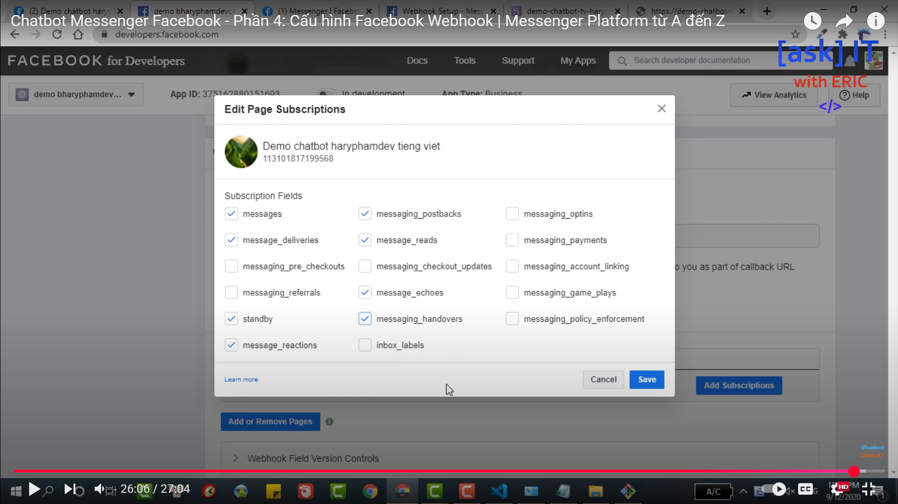

# Messenger Bot with py-facebook-webhook

This project runs a Facebook Messenger bot using [py-facebook-webhook](https://github.com/yc0/py-facebook-webhook) inside Docker.  
It uses **FastAPI/Flask-style webhook handling** and exposes it through **ngrok**.



---

## 🚀 Quick Start


### 1. Clone this repo
```bash
git clone https://github.com/yc0/py-facebook-webhook.git
cd py-facebook-webhook
```

### 2. Create `.env` file
```.env
NGROK_AUTHTOKEN=
PAGE_ACCESS_TOKEN=
VERIFY_TOKEN=dummy_text

AGENT_URL=http://host.docker.internal:2024
ASSISTANT_ID=search_agent
```

### 3. Run with Docker Compose
```bash
docker compose up --build
```

This will:
- Start the bot (`web` service on port **5000**).
- Start ngrok (`ngrok` service on port **4040**) tunneling your webhook.

---

## 🔍 Check ngrok URL
```bash
curl http://localhost:4040/api/tunnels
```

Copy the **https** URL and paste it into your **Facebook App Webhook settings**.

---

## 📦 Alternative: Run locally without Docker
```bash
pip install -r requirements.txt
VERIFY_TOKEN=your_verify_token PAGE_ACCESS_TOKEN=your_page_access_token python -m app.py
```

---

## 📚 References
- [Facebook Messenger Platform Docs](https://developers.facebook.com/docs/messenger-platform/)
- [yc0/py-facebook-webhook](https://github.com/yc0/py-facebook-webhook)
